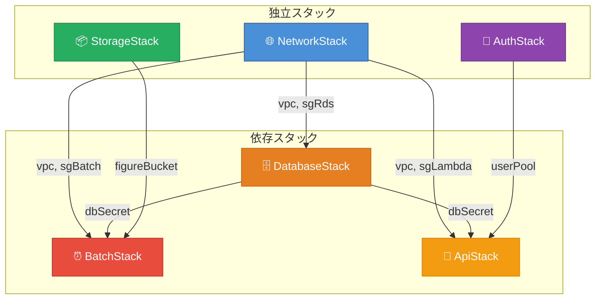
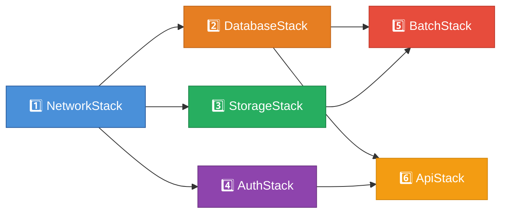

# CDK スタック アーキテクチャ図

## スタック間の依存関係

## 各スタックの中身

```mermaid
graph TB
    subgraph NS["🌐 NetworkStack"]
        direction TB
        VPC["VPC 10.0.0.0/16　2 AZ 構成"]
        PubSub["Public Subnet ×2　+ NAT Gateway"]
        PriSub["Private Subnet ×2　Lambda / RDS 配置"]
        SG_L["sg-lambda"]
        SG_B["sg-batch"]
        SG_R["sg-rds　Inbound: 5432　from sg-lambda, sg-batch"]
        VPC --- PubSub
        VPC --- PriSub
        VPC --- SG_L
        VPC --- SG_B
        VPC --- SG_R
    end

    subgraph DS["🗄️ DatabaseStack"]
        direction TB
        RDS["RDS PostgreSQL 16　db.t4g.micro"]
        SM["Secrets Manager　DB パスワード自動生成"]
        PGV["pgvector 拡張　デプロイ後に有効化"]
        ENC["AES-256 暗号化　KMS マネージド"]
        RDS --- SM
        RDS --- PGV
        RDS --- ENC
    end

    subgraph SS["📦 StorageStack"]
        direction TB
        S3["S3 バケット　ai-research-figures　SSE-S3 暗号化"]
        CF["CloudFront　OAC 経由アクセス　TTL 30日"]
        S3 --- CF
    end

    subgraph AS["🔐 AuthStack"]
        direction TB
        UP["Cognito User Pool　メール + パスワード"]
        GP["Google Provider　OAuth 連携"]
        AP["Apple Provider　OAuth 連携"]
        AC["App Client　Authorization Code + PKCE　ID Token: 1h / Refresh: 30d"]
        HD["Hosted UI ドメイン　ai-research-os"]
        UP --- GP
        UP --- AP
        UP --- AC
        UP --- HD
    end

    subgraph BS["⏰ BatchStack"]
        direction TB
        BL["Batch Lambda　Docker Image　1024MB / 15min timeout"]
        EB["EventBridge Rule　cron: 毎日 UTC 21:00　月〜金のみ"]
        IAM_B["IAM 権限　Secrets Manager 読取　S3 figures/* 書込"]
        EB -->|トリガー| BL
        BL --- IAM_B
    end

    subgraph APS["🚀 ApiStack"]
        direction TB
        APIGW["API Gateway　REST API"]
        AL["API Lambda　VPC Private Subnet"]
        CAuth["Cognito Authorizer　JWT 検証"]
        IAM_A["IAM 権限　Secrets Manager 読取　RDS 接続"]
        APIGW -->|認証| CAuth
        APIGW -->|ルーティング| AL
        AL --- IAM_A
    end

    style NS fill:#eaf2fb,stroke:#4a90d9
    style DS fill:#fdf2e9,stroke:#e67e22
    style SS fill:#eafaf1,stroke:#27ae60
    style AS fill:#f4ecf7,stroke:#8e44ad
    style BS fill:#fdedec,stroke:#e74c3c
    style APS fill:#fef9e7,stroke:#f39c12
```

## デプロイ順序

> [!NOTE]
> `StorageStack` と `AuthStack` は `NetworkStack` に依存しないため、`NetworkStack` と並行してデプロイ可能です。ただし `BatchStack` と `ApiStack` はすべての上流スタックが完了してから実行してください。
