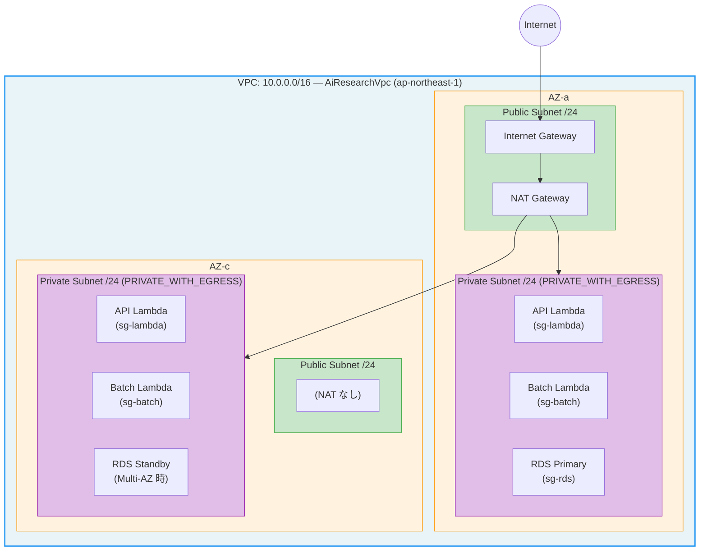
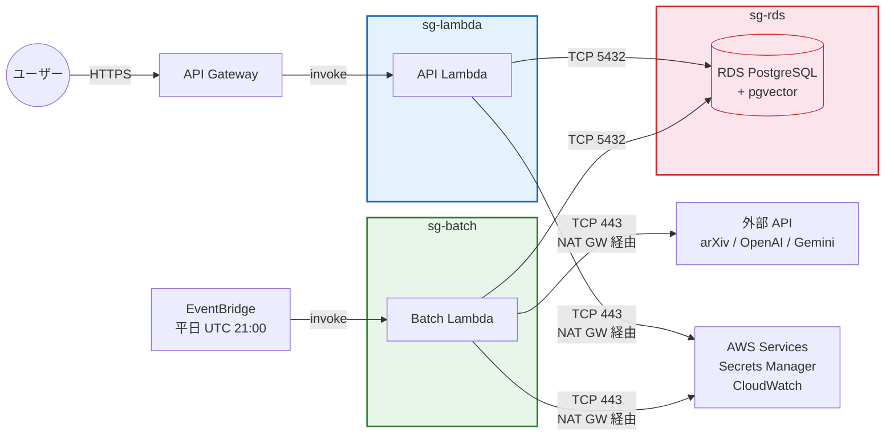
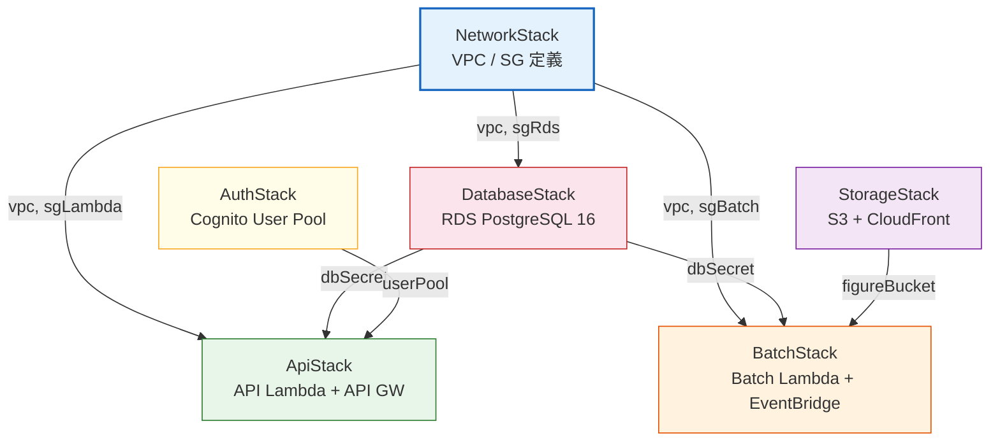

# VPC / ネットワーク設計解説

> **対象ファイル**: `infra/lib/network-stack.ts`（132行）
> **作成日**: 2026-02-19

---

## 1. 全体構成

> **補足**: CDK の `cidrMask: 24` と `maxAzs: 2` 指定により、CDK がサブネット CIDR を自動割当する。

---

## 2. VPC 設定詳細

| 項目 | 値 | 備考 |
|:---|:---|:---|
| **CIDR** | `10.0.0.0/16` | 65,536 IP アドレス |
| **AZ 数** | 2 | `maxAzs: 2` で ap-northeast-1a/1c を使用 |
| **Public サブネット** | 2（各 AZ に 1 つ） | NAT Gateway、Internet Gateway の配置先 |
| **Private サブネット** | 2（各 AZ に 1 つ） | `PRIVATE_WITH_EGRESS` — NAT 経由で外部通信可能 |
| **NAT Gateway** | **1 つのみ** | コスト対策（約 $32/月）。本番では 2 つに増やすべき |
| **Internet Gateway** | CDK 自動作成 | Public サブネット作成時に自動付与 |

### なぜ PRIVATE_WITH_EGRESS か

Lambda と RDS はプライベートサブネットに配置し、インターネットからの直接アクセスを遮断する。
一方で Lambda は以下の外部通信が必要なため、NAT Gateway 経由のアウトバウンド通信を許可している:

- **API Lambda**: AWS サービス（Secrets Manager, CloudWatch 等）への HTTPS 呼び出し
- **Batch Lambda**: arXiv API、OpenAI API、Gemini API への HTTPS 呼び出し

---

## 3. セキュリティグループ

3 つのセキュリティグループを定義し、最小権限の原則で通信を制御している。
全て `allowAllOutbound: false` で明示的にアウトバウンドを制限している点がポイント。

### sg-lambda（API Lambda 用）

| 方向 | プロトコル | ポート | 対象 | 用途 |
|:---|:---|:---|:---|:---|
| **Egress** | TCP | 443 | `0.0.0.0/0` | HTTPS（AWS サービス、外部 API） |
| **Egress** | TCP | 5432 | `sg-rds` | PostgreSQL 接続 |
| **Ingress** | — | — | — | なし（API Gateway → Lambda は VPC 外で呼び出される） |

### sg-batch（バッチ Lambda 用）

| 方向 | プロトコル | ポート | 対象 | 用途 |
|:---|:---|:---|:---|:---|
| **Egress** | TCP | 443 | `0.0.0.0/0` | HTTPS（arXiv / OpenAI / Gemini API） |
| **Egress** | TCP | 5432 | `sg-rds` | PostgreSQL 接続 |
| **Ingress** | — | — | — | なし（EventBridge → Lambda は VPC 外で呼び出される） |

### sg-rds（RDS PostgreSQL 用）

| 方向 | プロトコル | ポート | 対象 | 用途 |
|:---|:---|:---|:---|:---|
| **Ingress** | TCP | 5432 | `sg-lambda` | API Lambda からの DB 接続 |
| **Ingress** | TCP | 5432 | `sg-batch` | Batch Lambda からの DB 接続 |
| **Egress** | — | — | — | なし（DB はアウトバウンド不要） |

### セキュリティグループ間の通信フロー

---

## 4. CloudFormation Outputs

他スタックからの参照やコンソール確認のため、以下の値をエクスポートしている:

| Output 名 | Export 名 | 内容 |
|:---|:---|:---|
| `VpcId` | `AiResearch-VpcId` | VPC の ID |
| `SgLambdaId` | `AiResearch-SgLambdaId` | API Lambda 用 SG の ID |
| `SgBatchId` | `AiResearch-SgBatchId` | Batch Lambda 用 SG の ID |
| `SgRdsId` | `AiResearch-SgRdsId` | RDS 用 SG の ID |

---

## 5. 他スタックとの依存関係

NetworkStack は全スタックの基盤であり、以下のスタックがプロパティ経由で VPC / SG を受け取る:

---

## 6. 本番環境に向けた考慮事項

| 項目 | 現状（開発） | 本番推奨 |
|:---|:---|:---|
| **NAT Gateway 数** | 1（片方の AZ のみ） | 2（各 AZ に 1 つ。可用性向上） |
| **NAT Gateway コスト** | 約 $32/月 | 約 $64/月 |
| **RDS Multi-AZ** | false | true（自動フェイルオーバー） |
| **VPC Flow Logs** | 未設定 | 有効化（監査・トラブルシュート用） |
| **VPC Endpoints** | 未設定 | S3, Secrets Manager 等に追加（NAT 経由の通信削減・コスト最適化） |
| **Network ACL** | デフォルト（全許可） | 必要に応じてサブネット単位の制御を追加 |
