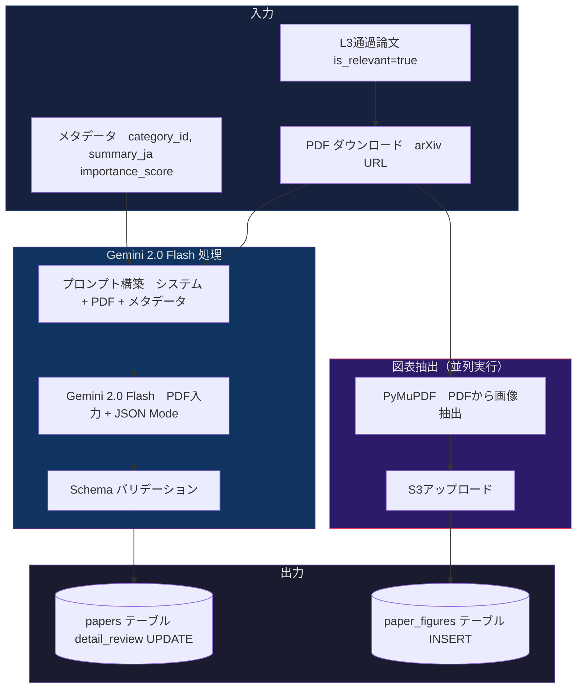

# AIエージェント設計書：PDF全文分析 & 詳細解説生成

## 1. 概要

L3（軽量フィルタ）を通過した論文に対し、**PDFを丸ごとGemini 2.0 Flashに投入**して
詳細な解説コンテンツを一括生成する。

```
従来想定: Abstract → マルチエージェント → 解説（複数API呼出、図表は別処理）
採用方式: PDF全文 → Gemini 1回 → 解説 + 図表分析（シングルパス）
```

**この方式を採用する理由:**
- Gemini 2.0 Flash は**PDFをネイティブ入力**として受け取れる
- 図表・数式・表を含む**論文の全コンテキスト**を踏まえた高品質な解説が生成できる
- マルチエージェントの複雑な State 管理が不要
- 1回のAPI呼出で全出力を得られるため、**レイテンシとコストが予測しやすい**

---

## 2. 処理フロー



**ポイント:** PDF分析（Gemini）と図表抽出（PyMuPDF）は**並列実行**。
PDF は1回だけダウンロードし、両方のプロセスで共有する。

---

## 3. モデル & API設定

| 項目 | 値 |
|:---|:---|
| **モデル** | Gemini 2.0 Flash |
| **入力** | PDF ファイル（バイナリ） + メタデータ（テキスト） |
| **出力モード** | JSON Mode（構造化出力を強制） |
| **temperature** | 0.3（創造性を少し許容。解説文の自然さのため） |
| **max_output_tokens** | 4,096 |
| **タイムアウト** | 60秒 |

---

## 4. プロンプト設計

### 4.1 システムプロンプト

```
You are an expert AI research analyst who produces detailed, multi-perspective paper reviews for a mobile learning app. Your audience ranges from beginners to senior engineers.

## Your Task
Given a full academic paper (PDF) and its metadata, generate a structured review with:
1. Automatic section selection — choose the most relevant sections for this paper
2. Three expert perspectives — AI Engineering, Mathematical Theory, and Business Impact
3. Three difficulty levels — Beginner, Intermediate, and Expert
4. Figure analysis — describe key figures/tables from the paper

## Section Candidates
Choose 3-5 of the following sections, based on what is most informative for THIS paper:
- research_background: Why this research matters, prior work
- overview: Core idea in 2-3 sentences
- novelty: What is new compared to existing approaches
- technical_details: Architecture, algorithms, key equations
- theoretical_basis: Mathematical foundations, proofs
- experimental_results: Benchmarks, ablation studies, key numbers
- business_impact: Industry applications, market implications

## Writing Guidelines
- Write ALL content in Japanese (日本語)
- Be specific: cite actual numbers, model names, and dataset names from the paper
- For mathematical content: use plain-language explanations, avoid raw LaTeX
- Each perspective should add UNIQUE value, not repeat the same content
- Beginner level: use analogies and avoid jargon
- Expert level: include specific hyperparameters, training details, and limitations
```

### 4.2 ユーザープロンプトテンプレート

```
## Paper Metadata
- Title: {title}
- arXiv ID: {arxiv_id}
- Category: {category_name} (ID: {category_id})
- L2 Importance Score: {importance_score}
- L3 Quick Summary: {summary_ja}

## Instructions
Please analyze the attached PDF and generate a detailed review.
```

---

## 5. 出力仕様（JSON Schema）

```json
{
  "$schema": "http://json-schema.org/draft-07/schema#",
  "type": "object",
  "required": ["sections", "perspectives", "levels", "figure_analysis"],
  "properties": {
    "sections": {
      "type": "array",
      "items": {
        "type": "object",
        "required": ["section_id", "title_ja", "content_ja"],
        "properties": {
          "section_id": {
            "type": "string",
            "enum": ["research_background", "overview", "novelty",
                     "technical_details", "theoretical_basis",
                     "experimental_results", "business_impact"]
          },
          "title_ja": { "type": "string" },
          "content_ja": { "type": "string", "maxLength": 800 }
        }
      },
      "minItems": 3,
      "maxItems": 5
    },
    "perspectives": {
      "type": "object",
      "required": ["ai_engineer", "mathematician", "business"],
      "properties": {
        "ai_engineer": {
          "type": "string", "maxLength": 500,
          "description": "AIエンジニア視点: 実装上の要点、使える技術、既存手法との比較"
        },
        "mathematician": {
          "type": "string", "maxLength": 500,
          "description": "数学視点: 理論的な新しさ、証明のポイント、数式の直感的説明"
        },
        "business": {
          "type": "string", "maxLength": 500,
          "description": "ビジネス視点: 産業応用、コスト影響、競争優位性への示唆"
        }
      }
    },
    "levels": {
      "type": "object",
      "required": ["beginner", "intermediate", "expert"],
      "properties": {
        "beginner": {
          "type": "string", "maxLength": 400,
          "description": "初学者向け: 専門用語を使わず、たとえ話で説明"
        },
        "intermediate": {
          "type": "string", "maxLength": 400,
          "description": "中級者向け: 技術用語OK、手法の位置づけと意義を説明"
        },
        "expert": {
          "type": "string", "maxLength": 500,
          "description": "上級者向け: ハイパーパラメータ、制約、再現時の注意点"
        }
      }
    },
    "figure_analysis": {
      "type": "array",
      "items": {
        "type": "object",
        "required": ["figure_ref", "description_ja"],
        "properties": {
          "figure_ref": {
            "type": "string",
            "description": "Figure 1, Table 2 等の参照名"
          },
          "description_ja": {
            "type": "string", "maxLength": 300,
            "description": "この図表が何を示しているかの日本語解説"
          },
          "is_key_figure": {
            "type": "boolean",
            "description": "この論文を理解する上で最も重要な図か"
          }
        }
      }
    },
    "one_line_takeaway": {
      "type": "string", "maxLength": 100,
      "description": "この論文の最大のポイントを1行で（日本語）"
    }
  }
}
```

### 5.1 出力例

```json
{
  "sections": [
    {
      "section_id": "overview",
      "title_ja": "概要",
      "content_ja": "本論文は、長文コンテキスト処理時のKV Cacheメモリ消費を動的圧縮する手法「DynamicKV」を提案する。従来のKV Cache管理では..."
    },
    {
      "section_id": "technical_details",
      "title_ja": "技術的な内容",
      "content_ja": "DynamicKVは、Attention重みの分布に基づいてKVペアの重要度をリアルタイムに評価し..."
    },
    {
      "section_id": "experimental_results",
      "title_ja": "実験結果",
      "content_ja": "LongBench上での評価では、KV Cache使用量を62%削減しながら、精度低下を1.2%以内に抑えた..."
    },
    {
      "section_id": "novelty",
      "title_ja": "新規性",
      "content_ja": "既存のStatic EvictionやH2Oと異なり、レイヤーごとの重要度分布を動的に..."
    }
  ],
  "perspectives": {
    "ai_engineer": "実装観点: vLLMのPagedAttentionと組み合わせることで、32Kコンテキストのバッチサイズを2.3倍に拡大可能。ただし追加の重要度計算オーバーヘッドが約8%あるため、レイテンシ重視のユースケースではトレードオフを検討する必要がある。",
    "mathematician": "理論面: Attention重みのL1ノルムを重要度の近似指標として使用。これは情報理論的にはKLダイバージェンスの上界近似に対応しており、完全な最適性は保証されないものの、実験的に十分な精度を達成している。",
    "business": "vLLMやTGIを運用するAPI提供事業者にとって、同一GPUでの同時接続数が実質2倍以上になる。A100 8枚構成のクラスタでは月額数千ドルのインフラコスト削減が見込める。"
  },
  "levels": {
    "beginner": "AIが長い文章を読むとき、途中で読んだ内容を覚えておく「メモ帳」が必要です。この研究は、そのメモ帳を賢く整理して、大切な部分だけ残す方法を提案しました。これにより同じPCでも、より長い文章を処理できるようになります。",
    "intermediate": "KV CacheはTransformerの推論時にAttention計算の再利用を可能にするメモリ構造だが、長文処理では線形にメモリ消費が増大する。DynamicKVは各レイヤーのAttention重みを分析し、低重要度のKVペアを動的に破棄することで、品質を維持しつつメモリを62%削減する。",
    "expert": "実装の要点: レイヤーごとにAttention sink（最初の数トークン）を固定保持しつつ、残りのKVペアにL1ノルム基準のEvictionを適用。閾値τ=0.15で62%圧縮、τ=0.10で45%圧縮。GQAとの併用時はKey共有グループ単位でEvictionするため、MQAモデル（Llama 3等）では効果が限定的な点に注意。"
  },
  "figure_analysis": [
    {
      "figure_ref": "Figure 1",
      "description_ja": "DynamicKVのアーキテクチャ全体図。各レイヤーのAttention重み分布から重要度を計算し、閾値以下のKVペアをEvictするフローを示す。",
      "is_key_figure": true
    },
    {
      "figure_ref": "Table 2",
      "description_ja": "LongBench各タスクにおける圧縮率と精度のトレードオフ。要約タスクでは圧縮に強く、QAタスクでは精度低下が顕著。",
      "is_key_figure": true
    },
    {
      "figure_ref": "Figure 3",
      "description_ja": "レイヤー別のAttention重み分布ヒートマップ。浅いレイヤーは均一分布、深いレイヤーはスパースな傾向が見て取れる。",
      "is_key_figure": false
    }
  ],
  "one_line_takeaway": "KV Cacheを動的に62%圧縮し、長文LLM推論のメモリ効率を劇的に改善"
}
```

---

## 6. コスト見積もり

### 6.1 トークン見積もり

| 項目 | トークン数 |
|:---|:---|
| PDF入力 (10〜30ページ) | 15,000〜30,000 |
| プロンプト（システム + メタ） | ~800 |
| **入力合計** | **~20,000** |
| **出力（JSON）** | **~2,500** |

### 6.2 日次 / 月次コスト（Gemini 2.0 Flash）

| 項目 | 値 |
|:---|:---|
| L3通過論文 | 10〜30件/日 |
| 1論文あたりコスト | 入力 $0.002 + 出力 $0.001 = **$0.003** |
| **日次コスト** | **$0.03〜$0.09** |
| **月次コスト** | **$0.90〜$2.70** |

### 6.3 全パイプライン月次コスト（更新版）

| フェーズ | 月次コスト |
|:---|:---|
| L1 arXiv API | $0.00 |
| L2 Embedding | ~$0.04 |
| L3 フィルタ（Abstract） | ~$0.40 |
| **PDF全文分析（本設計）** | **~$1.80** |
| S3 図表保存 | ~$0.10 |
| **合計** | **~$2.34/月** |

> ☕ コーヒー1杯分。論文30件/日の全文分析としては極めて安価。

---

## 7. 実装設計

### 7.1 処理の並列化

```python
import asyncio
from pathlib import Path

async def process_relevant_paper(paper: dict, pdf_bytes: bytes):
    """L3通過論文に対する後処理: PDF分析 + 図表抽出を並列実行"""

    # 並列実行: Gemini分析 & PyMuPDF図表抽出
    analysis_task = asyncio.create_task(
        generate_detail_review(paper, pdf_bytes)
    )
    figures_task = asyncio.create_task(
        extract_and_upload_figures(paper["arxiv_id"], pdf_bytes)
    )

    detail_review, figures = await asyncio.gather(
        analysis_task, figures_task
    )

    # DB更新
    await update_paper_detail(paper["arxiv_id"], detail_review)
    await insert_paper_figures(paper["id"], figures)

    return detail_review, figures
```

### 7.2 Gemini API呼び出し

```python
import google.generativeai as genai

async def generate_detail_review(paper: dict, pdf_bytes: bytes) -> dict:
    model = genai.GenerativeModel("gemini-2.0-flash")

    # PDF をファイルとしてアップロード
    pdf_file = genai.upload_file(
        data=pdf_bytes,
        mime_type="application/pdf",
        display_name=f"{paper['arxiv_id']}.pdf"
    )

    prompt = build_user_prompt(paper)

    response = model.generate_content(
        contents=[SYSTEM_PROMPT, pdf_file, prompt],
        generation_config=genai.GenerationConfig(
            response_mime_type="application/json",
            response_schema=DETAIL_REVIEW_SCHEMA,
            temperature=0.3,
            max_output_tokens=4096,
        ),
    )

    result = json.loads(response.text)

    # アップロードしたファイルを削除（クリーンアップ）
    genai.delete_file(pdf_file.name)

    return result
```

### 7.3 全体バッチ実行

```python
CONCURRENCY = 3  # PDF処理は重いため並列数を抑える

async def run_post_l3(relevant_papers: list[dict]):
    semaphore = asyncio.Semaphore(CONCURRENCY)

    async def process_with_limit(paper):
        async with semaphore:
            pdf_bytes = await download_pdf(paper["pdf_url"])
            return await process_relevant_paper(paper, pdf_bytes)

    results = await asyncio.gather(
        *[process_with_limit(p) for p in relevant_papers],
        return_exceptions=True
    )

    # エラーレポート
    errors = [r for r in results if isinstance(r, Exception)]
    if errors:
        log.warning(f"{len(errors)}/{len(relevant_papers)} papers failed")

    return results
```

---

## 8. DB更新仕様

```sql
-- L3後の詳細解説をpapers テーブルに保存
UPDATE papers
SET
    detail_review = :detail_review_json,   -- 上記JSON全体をJSONBで保存
    updated_at    = NOW()
WHERE arxiv_id = :arxiv_id;
```

### `detail_review` カラムのクエリ例（アプリAPI用）

```sql
-- セクション一覧の取得
SELECT
    arxiv_id,
    title,
    summary_ja,
    detail_review->'sections' AS sections,
    detail_review->'perspectives' AS perspectives,
    detail_review->'one_line_takeaway' AS takeaway
FROM papers
WHERE is_relevant = TRUE
  AND detail_review IS NOT NULL
ORDER BY published_at DESC
LIMIT 20;

-- レベル別テキストの取得（アプリ側でレベル切替時）
SELECT
    detail_review->'levels'->>:level AS level_text  -- 'beginner' / 'intermediate' / 'expert'
FROM papers
WHERE arxiv_id = :arxiv_id;
```

---

## 9. エラーハンドリング

| エラー種別 | 対応策 |
|:---|:---|
| PDF ダウンロード失敗 | リトライ1回。それでも失敗なら `detail_review = NULL` で保存、翌日再処理 |
| Gemini 429 (Rate Limit) | 指数バックオフ（2秒 → 4秒 → 8秒）、最大3回 |
| Gemini 500/503 | 5分待ちリトライ。2回失敗でスキップ |
| JSON パースエラー | リトライ1回。不正なら abstract のみで再生成（PDFなし fallback） |
| 出力トークン超過 | `max_output_tokens` 内に収まらない場合、`figure_analysis` を省略して再実行 |
| PDF 破損 | ログ出力して abstract のみ fallback |

### Fallback 戦略

```
Primary:   PDF全文 → Gemini → 完全な解説
Fallback:  Abstract のみ → Gemini → 簡易版解説（perspectives, levels のみ）
```

---

## 10. ログ出力仕様

```json
{
  "phase": "post_l3_analysis",
  "execution_date": "2026-02-12",
  "input_count": 23,
  "success_count": 22,
  "fallback_count": 1,
  "error_count": 0,
  "total_input_tokens": 460000,
  "total_output_tokens": 55000,
  "estimated_cost_usd": 0.068,
  "processing_time_sec": 320,
  "avg_sections_per_paper": 4.2,
  "avg_figures_analyzed": 3.8,
  "pdf_download_failures": 0
}
```

---

## 11. アプリ側の表示設計との対応

| JSON フィールド | アプリ画面での使用場所 |
|:---|:---|
| `sections[]` | 論文詳細画面の本文セクション（自動選択されたもののみ表示） |
| `perspectives.ai_engineer` | 「🔧 AIエンジニア視点」タブ |
| `perspectives.mathematician` | 「📐 数学視点」タブ |
| `perspectives.business` | 「💼 ビジネス視点」タブ |
| `levels.beginner` | レベル切替ボタン：初学者モード |
| `levels.intermediate` | レベル切替ボタン：中級モード |
| `levels.expert` | レベル切替ボタン：エキスパートモード |
| `figure_analysis[]` | 図表カルーセル内のキャプション |
| `one_line_takeaway` | ホーム画面のカード表示 / 詳細画面の冒頭 |
