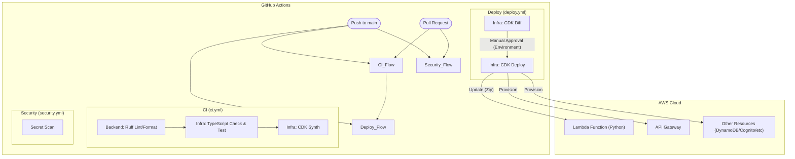
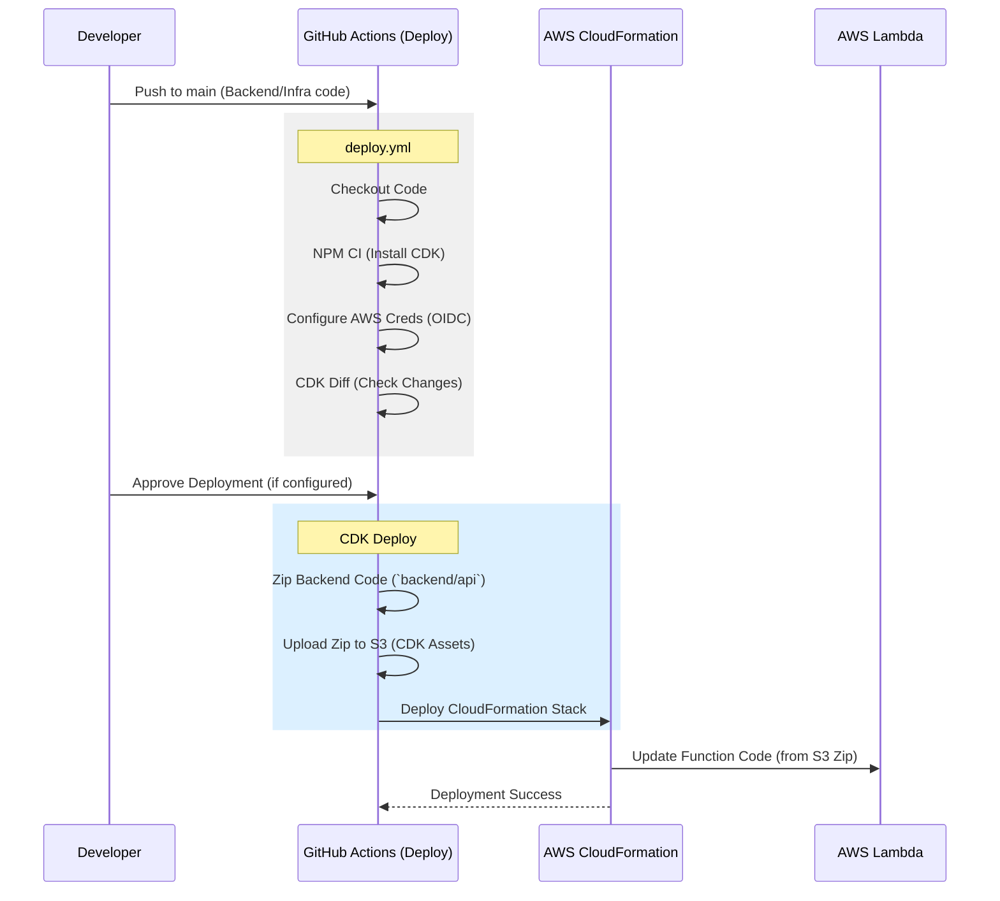

# CI/CD 現在の実装状況 (Current Implementation Status)

現在のGitHub ActionsワークフローとAWS CDKの実装に基づいた構成図です。

## 1. 全体フロー (Overview)

## 2. 詳細: Backend & Infra Deploy Flow (Current)

現状の実装では、Backendコード（Python）はDockerコンテナではなく、CDKによって**Zipアセット**としてLambdaにデプロイされています。

## 3. 課題 (Gap Analysis)

| 機能 | 設計 (Specification) | 現状 (Current Implementation) | 乖離 (Gap) |
| :--- | :--- | :--- | :--- |
| **Backend Deploy** | Docker Image (ECR) + Lambda Container | Zip Asset Upload | **要対応** (Docker化 or 設計変更) |
| **Backend Test** | pytest, mypy | 未実装 | **要追加** |
| **Frontend CI/CD** | Lint, Test, Build (EAS/Fastlane) | 未実装 | **要新規作成** |
