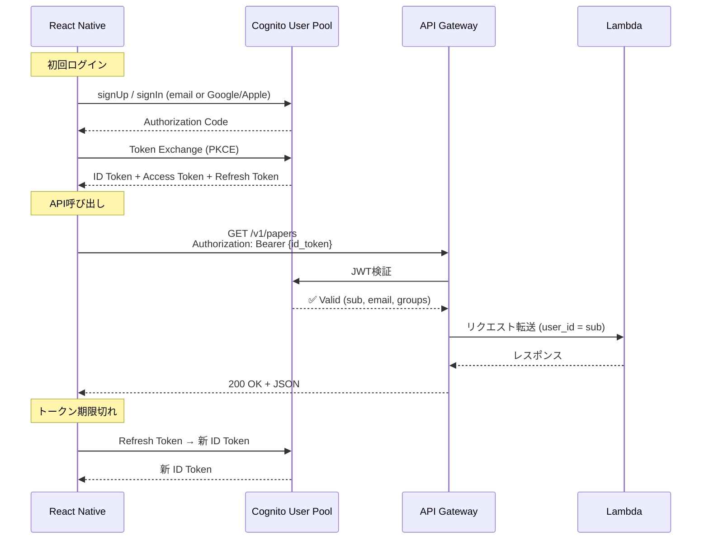

# API仕様書 (OpenAPI)

## 1. 概要

| 項目 | 値 |
|:---|:---|
| **ベースURL** | `https://api.{domain}/v1` |
| **プロトコル** | HTTPS (TLS 1.3) |
| **認証** | Cognito JWT (Bearer Token) |
| **レスポンス形式** | JSON |
| **ページネーション** | カーソルベース (cursor + limit) |
| **バージョニング** | URLパス (`/v1/`) |

---

## 2. 認証フロー



### 2.1 トークン仕様

| トークン | 有効期限 | 用途 |
|:---|:---|:---|
| **ID Token** | 1時間 | API Gateway の Cognito Authorizer で検証 |
| **Access Token** | 1時間 | Cognitoユーザー情報へのアクセス |
| **Refresh Token** | 30日 | ID/Access Token の自動更新 |

### 2.2 認証ヘッダー

```
Authorization: Bearer eyJraWQiOiJxx...（ID Token）
```

---

## 3. エンドポイント一覧

| メソッド | パス | 認証 | 説明 |
|:---|:---|:---|:---|
| `GET` | `/v1/papers` | ✅ | 論文一覧（タイムライン） |
| `GET` | `/v1/papers/:arxiv_id` | ✅ | 論文詳細 |
| `GET` | `/v1/papers/:arxiv_id/figures` | ✅ | 論文の図表一覧 |
| `POST` | `/v1/papers/:arxiv_id/view` | ✅ | 閲覧記録（既読マーク） |
| `GET` | `/v1/categories` | ✅ | カテゴリ一覧 |
| `GET` | `/v1/bookmarks` | ✅ | お気に入り一覧 |
| `POST` | `/v1/bookmarks` | ✅ | お気に入り追加 |
| `DELETE` | `/v1/bookmarks/:id` | ✅ | お気に入り削除 |
| `GET` | `/v1/users/me` | ✅ | ユーザー情報取得 |
| `PUT` | `/v1/users/me/settings` | ✅ | ユーザー設定更新 |
| `GET` | `/v1/users/me/stats` | ✅ | ユーザー統計 |
| `GET` | `/v1/health` | ❌ | ヘルスチェック |

---

## 4. エンドポイント詳細

### 4.1 `GET /v1/papers` — 論文一覧

ホーム画面のタイムライン表示用。無限スクロール対応。

**クエリパラメータ:**

| パラメータ | 型 | 必須 | デフォルト | 説明 |
|:---|:---|:---|:---|:---|
| `category_id` | integer | ❌ | — | カテゴリでフィルタ (1-6) |
| `importance` | integer | ❌ | — | 重要度フィルタ (1-5) |
| `from_date` | string (YYYY-MM-DD) | ❌ | — | 開始日 |
| `to_date` | string (YYYY-MM-DD) | ❌ | — | 終了日 |
| `cursor` | string | ❌ | — | ページネーション用カーソル |
| `limit` | integer | ❌ | 20 | 取得件数 (max: 50) |

**レスポンス: `200 OK`**

```json
{
  "data": [
    {
      "arxiv_id": "2402.12345",
      "title": "Efficient KV Cache Compression for Long-Context LLM Serving",
      "category_id": 4,
      "category_name": "インフラ & 推論最適化",
      "importance": 4,
      "summary_ja": "KV Cacheを動的に62%圧縮し、長文LLM推論のメモリ効率を劇的に改善",
      "one_line_takeaway": "KV Cacheを動的に62%圧縮し、長文LLM推論のメモリ効率を劇的に改善",
      "authors": ["Alice Smith", "Bob Chen"],
      "published_at": "2026-02-11T00:00:00Z",
      "thumbnail_url": "https://cdn.example.com/figures/2402.12345/fig_0.png",
      "is_bookmarked": false,
      "is_viewed": true
    }
  ],
  "pagination": {
    "next_cursor": "eyJwdWJsaXNoZWRfYXQiOiIyMDI2LTAyLTEwVDAwOjAwOjAwWiIsImlkIjo0Mn0=",
    "has_next": true,
    "total_count": 156
  }
}
```

**SQLイメージ:**

```sql
SELECT p.*, 
       EXISTS(SELECT 1 FROM bookmarks b WHERE b.paper_id = p.id AND b.user_id = :user_id) AS is_bookmarked,
       EXISTS(SELECT 1 FROM paper_views pv WHERE pv.paper_id = p.id AND pv.user_id = :user_id) AS is_viewed
FROM papers p
WHERE p.is_relevant = TRUE
  AND p.detail_review IS NOT NULL
  AND (:category_id IS NULL OR p.category_id = :category_id)
  AND (:from_date IS NULL OR p.published_at >= :from_date)
ORDER BY p.published_at DESC, p.id DESC
LIMIT :limit;
```

---

### 4.2 `GET /v1/papers/:arxiv_id` — 論文詳細

論文詳細画面用。レベル別テキスト・3視点解説・セクションを全て返す。

**パスパラメータ:**

| パラメータ | 型 | 説明 |
|:---|:---|:---|
| `arxiv_id` | string | arXiv ID (例: "2402.12345") |

**レスポンス: `200 OK`**

```json
{
  "data": {
    "arxiv_id": "2402.12345",
    "title": "Efficient KV Cache Compression for Long-Context LLM Serving",
    "abstract": "We propose a novel method for compressing KV cache...",
    "authors": ["Alice Smith", "Bob Chen"],
    "pdf_url": "https://arxiv.org/pdf/2402.12345",
    "category_id": 4,
    "category_name": "インフラ & 推論最適化",
    "importance": 4,
    "published_at": "2026-02-11T00:00:00Z",
    "summary_ja": "KV Cacheを動的に62%圧縮し、長文LLM推論のメモリ効率を劇的に改善",

    "detail": {
      "one_line_takeaway": "KV Cacheを動的に62%圧縮し、長文LLM推論のメモリ効率を劇的に改善",
      "sections": [
        {
          "section_id": "overview",
          "title_ja": "概要",
          "content_ja": "本論文は、長文コンテキスト処理時の..."
        },
        {
          "section_id": "technical_details",
          "title_ja": "技術的な内容",
          "content_ja": "DynamicKVは、Attention重みの分布に基づいて..."
        }
      ],
      "perspectives": {
        "ai_engineer": "実装観点: vLLMのPagedAttentionと組み合わせることで...",
        "mathematician": "理論面: Attention重みのL1ノルムを重要度の近似指標として...",
        "business": "vLLMやTGIを運用するAPI提供事業者にとって..."
      },
      "levels": {
        "beginner": "AIが長い文章を読むとき、途中で読んだ内容を覚えておく...",
        "intermediate": "KV CacheはTransformerの推論時にAttention計算の再利用を...",
        "expert": "実装の要点: レイヤーごとにAttention sinkを固定保持しつつ..."
      },
      "figure_analysis": [
        {
          "figure_ref": "Figure 1",
          "description_ja": "DynamicKVのアーキテクチャ全体図...",
          "is_key_figure": true
        }
      ]
    },

    "is_bookmarked": false,
    "is_viewed": true
  }
}
```

**エラーレスポンス: `404 Not Found`**

```json
{
  "error": {
    "code": "PAPER_NOT_FOUND",
    "message": "Paper with arxiv_id '2402.99999' not found"
  }
}
```

---

### 4.3 `POST /v1/papers/:arxiv_id/view` — 閲覧記録

論文詳細画面を開いた時にアプリから自動送信。タイムラインでのグレーアウト表示に使用。

**パスパラメータ:**

| パラメータ | 型 | 説明 |
|:---|:---|:---|
| `arxiv_id` | string | arXiv ID (例: "2402.12345") |

**リクエストボディ:** なし

**レスポンス: `201 Created`**（初回閲覧）/ **`200 OK`**（既に閲覧済み）

```json
{
  "data": {
    "viewed_at": "2026-02-12T13:45:00Z"
  }
}
```

**SQL (UPSERT):**

```sql
INSERT INTO paper_views (user_id, paper_id)
VALUES (:user_id, (SELECT id FROM papers WHERE arxiv_id = :arxiv_id))
ON CONFLICT (user_id, paper_id) DO NOTHING
RETURNING viewed_at;
```

---

### 4.4 `GET /v1/papers/:arxiv_id/figures` — 図表一覧

**レスポンス: `200 OK`**

```json
{
  "data": [
    {
      "id": 1,
      "figure_index": 0,
      "s3_url": "https://cdn.example.com/figures/2402.12345/fig_0.png",
      "width": 800,
      "height": 600,
      "caption": "DynamicKVのアーキテクチャ全体図"
    },
    {
      "id": 2,
      "figure_index": 1,
      "s3_url": "https://cdn.example.com/figures/2402.12345/fig_1.png",
      "width": 1200,
      "height": 400,
      "caption": null
    }
  ]
}
```

---

### 4.5 `GET /v1/categories` — カテゴリ一覧

**レスポンス: `200 OK`**

```json
{
  "data": [
    { "id": 1, "name": "基盤モデル & アーキテクチャ", "paper_count": 28 },
    { "id": 2, "name": "学習 & チューニング", "paper_count": 15 },
    { "id": 3, "name": "アプリケーションエンジニアリング", "paper_count": 18 },
    { "id": 4, "name": "インフラ & 推論最適化", "paper_count": 12 },
    { "id": 5, "name": "評価 & 安全性", "paper_count": 9 },
    { "id": 6, "name": "規制 & ビジネス", "paper_count": 4 }
  ]
}
```

---

### 4.6 `GET /v1/bookmarks` — お気に入り一覧

**クエリパラメータ:**

| パラメータ | 型 | 必須 | デフォルト | 説明 |
|:---|:---|:---|:---|:---|
| `cursor` | string | ❌ | — | カーソル |
| `limit` | integer | ❌ | 20 | 取得件数 (max: 50) |

**レスポンス: `200 OK`**

```json
{
  "data": [
    {
      "bookmark_id": 42,
      "bookmarked_at": "2026-02-11T15:30:00Z",
      "paper": {
        "arxiv_id": "2402.12345",
        "title": "Efficient KV Cache Compression...",
        "category_id": 4,
        "category_name": "インフラ & 推論最適化",
        "importance": 4,
        "summary_ja": "KV Cacheを動的に62%圧縮し..."
      }
    }
  ],
  "pagination": {
    "next_cursor": "...",
    "has_next": true
  }
}
```

---

### 4.7 `POST /v1/bookmarks` — お気に入り追加

**リクエストボディ:**

```json
{
  "arxiv_id": "2402.12345"
}
```

**レスポンス: `201 Created`**

```json
{
  "data": {
    "bookmark_id": 43,
    "bookmarked_at": "2026-02-12T01:00:00Z"
  }
}
```

**エラー: `409 Conflict`**（既にブックマーク済み）

```json
{
  "error": {
    "code": "ALREADY_BOOKMARKED",
    "message": "Paper '2402.12345' is already bookmarked"
  }
}
```

---

### 4.8 `DELETE /v1/bookmarks/:id` — お気に入り削除

**レスポンス: `204 No Content`**

**エラー: `403 Forbidden`**（他人のブックマーク）

```json
{
  "error": {
    "code": "FORBIDDEN",
    "message": "You cannot delete other users' bookmarks"
  }
}
```

---

### 4.9 `GET /v1/users/me` — ユーザー情報

**レスポンス: `200 OK`**

```json
{
  "data": {
    "id": 1,
    "email": "user@example.com",
    "display_name": "Kazuya",
    "auth_provider": "google",
    "language": "ja",
    "default_level": 2,
    "created_at": "2026-01-15T00:00:00Z"
  }
}
```

---

### 4.10 `PUT /v1/users/me/settings` — ユーザー設定更新

**リクエストボディ:**

```json
{
  "display_name": "Kazuya S.",
  "language": "ja",
  "default_level": 3
}
```

**バリデーション:**

| フィールド | 型 | 制約 |
|:---|:---|:---|
| `display_name` | string | max 100文字。省略時は変更なし |
| `language` | string | `"ja"` or `"en"` |
| `default_level` | integer | 1, 2, or 3 |

**レスポンス: `200 OK`** — 更新後のユーザー情報を返す

---

### 4.11 `GET /v1/users/me/stats` — ユーザー統計

設定画面の統計表示用。

**レスポンス: `200 OK`**

```json
{
  "data": {
    "papers_viewed": 142,
    "bookmarks_count": 23,
    "most_viewed_category": {
      "id": 4,
      "name": "インフラ & 推論最適化",
      "count": 48
    },
    "member_since": "2026-01-15T00:00:00Z"
  }
}
```

---

## 5. 共通仕様

### 5.1 エラーレスポンス形式

```json
{
  "error": {
    "code": "ERROR_CODE",
    "message": "Human-readable error description"
  }
}
```

| HTTPステータス | code | 発生条件 |
|:---|:---|:---|
| `400` | `INVALID_PARAMS` | パラメータ不正 |
| `401` | `UNAUTHORIZED` | トークン無し / 期限切れ |
| `403` | `FORBIDDEN` | 他ユーザーのリソースへのアクセス |
| `404` | `NOT_FOUND` | リソースが存在しない |
| `409` | `ALREADY_EXISTS` | 重複作成（ブックマーク等） |
| `429` | `RATE_LIMITED` | レートリミット超過 |
| `500` | `INTERNAL_ERROR` | サーバー内部エラー |

### 5.2 レートリミット

| 対象 | 制限 |
|:---|:---|
| 認証済みユーザー | 100リクエスト / 分 |
| ヘルスチェック | 10リクエスト / 分 |

レスポンスヘッダー:
```
X-RateLimit-Limit: 100
X-RateLimit-Remaining: 87
X-RateLimit-Reset: 1707700800
```

### 5.3 ページネーション（カーソルベース）

**オフセットではなくカーソル方式を採用する理由:**
- 新規論文が日次で追加されるため、オフセットだとページ間でズレが発生する
- カーソルは `published_at` + `id` の複合キーをBase64エンコード

```
# 初回リクエスト
GET /v1/papers?limit=20

# 次ページ
GET /v1/papers?limit=20&cursor=eyJwdWJsaXNoZWRfYXQiOi...
```

### 5.4 キャッシュ

| エンドポイント | Cache-Control |
|:---|:---|
| `GET /v1/papers` | `private, max-age=60` |
| `GET /v1/papers/:id` | `private, max-age=300` |
| `GET /v1/papers/:id/figures` | `public, max-age=86400` |
| `GET /v1/categories` | `public, max-age=3600` |
| その他 | `no-cache` |

---

## 6. TypeScript Interface 定義

```typescript
// --- Request Types ---

interface PapersQuery {
  category_id?: number;
  importance?: number;
  from_date?: string;   // YYYY-MM-DD
  to_date?: string;     // YYYY-MM-DD
  cursor?: string;
  limit?: number;       // default: 20, max: 50
}

interface CreateBookmarkRequest {
  arxiv_id: string;
}

interface UpdateSettingsRequest {
  display_name?: string;
  language?: 'ja' | 'en';
  default_level?: 1 | 2 | 3;
}

// --- Response Types ---

interface PaperSummary {
  arxiv_id: string;
  title: string;
  category_id: number;
  category_name: string;
  importance: number;
  summary_ja: string;
  one_line_takeaway: string;
  authors: string[];
  published_at: string;
  thumbnail_url: string | null;
  is_bookmarked: boolean;
  is_viewed: boolean;
}

interface PaperDetail extends PaperSummary {
  abstract: string;
  pdf_url: string;
  detail: {
    one_line_takeaway: string;
    sections: Section[];
    perspectives: Perspectives;
    levels: Levels;
    figure_analysis: FigureAnalysis[];
  };
}

interface Section {
  section_id: string;
  title_ja: string;
  content_ja: string;
}

interface Perspectives {
  ai_engineer: string;
  mathematician: string;
  business: string;
}

interface Levels {
  beginner: string;
  intermediate: string;
  expert: string;
}

interface FigureAnalysis {
  figure_ref: string;
  description_ja: string;
  is_key_figure: boolean;
}

interface PaperFigure {
  id: number;
  figure_index: number;
  s3_url: string;
  width: number | null;
  height: number | null;
  caption: string | null;
}

interface Bookmark {
  bookmark_id: number;
  bookmarked_at: string;
  paper: PaperSummary;
}

interface Category {
  id: number;
  name: string;
  paper_count: number;
}

interface UserProfile {
  id: number;
  email: string;
  display_name: string | null;
  auth_provider: 'email' | 'google' | 'apple';
  language: 'ja' | 'en';
  default_level: 1 | 2 | 3;
  created_at: string;
}

interface UserStats {
  papers_viewed: number;
  bookmarks_count: number;
  most_viewed_category: { id: number; name: string; count: number } | null;
  member_since: string;
}

interface Pagination {
  next_cursor: string | null;
  has_next: boolean;
  total_count?: number;
}

interface ApiResponse<T> {
  data: T;
  pagination?: Pagination;
}

interface ApiError {
  error: {
    code: string;
    message: string;
  };
}
```
