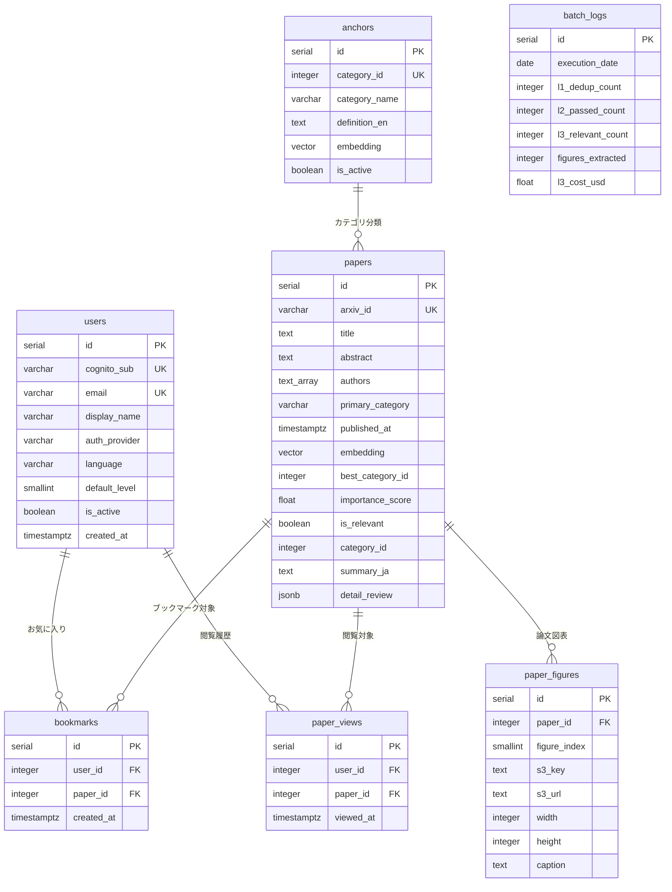

# データベース物理設計書

## 1. 概要

| 項目 | 値 |
|:---|:---|
| **RDBMS** | Amazon RDS for PostgreSQL 16 |
| **拡張** | pgvector (ベクトル検索) |
| **接続** | VPC内プライベートサブネット |
| **インスタンス** | db.t4g.micro（開発）→ db.t4g.small（本番） |

---

## 2. テーブル定義

### 2.1 papers — 論文データ（コア）

```sql
CREATE EXTENSION IF NOT EXISTS vector;

CREATE TABLE papers (
    id               SERIAL PRIMARY KEY,
    arxiv_id         VARCHAR(20) UNIQUE NOT NULL,
    title            TEXT NOT NULL,
    abstract         TEXT NOT NULL,
    authors          TEXT[] NOT NULL,
    pdf_url          TEXT,
    primary_category VARCHAR(10) NOT NULL,       -- "cs.CL" 等
    all_categories   TEXT[],                      -- クロスリスト含む
    published_at     TIMESTAMPTZ NOT NULL,
    embedding        vector(1536),

    -- L1 メタ
    matched_queries  INTEGER[] DEFAULT '{}',      -- ヒットしたクエリカテゴリID群

    -- L2 結果
    best_category_id INTEGER,
    max_score        FLOAT,
    hit_count        INTEGER,
    importance_score FLOAT,
    all_scores       JSONB,                       -- {"1": 0.41, "2": 0.28, ...}

    -- L3 結果
    is_relevant      BOOLEAN,
    category_id      INTEGER,
    confidence       FLOAT,
    importance       SMALLINT CHECK (importance BETWEEN 1 AND 5),
    summary_ja       TEXT,
    reasoning        TEXT,
    detail_review    JSONB,                       -- 詳細解説（Gemini PDF全文分析出力）

    -- タイムスタンプ
    created_at       TIMESTAMPTZ DEFAULT NOW(),
    updated_at       TIMESTAMPTZ DEFAULT NOW()
);

COMMENT ON TABLE papers IS '論文メタデータ + L1/L2/L3 処理結果';
```

### 2.2 anchors — カテゴリアンカー

```sql
CREATE TABLE anchors (
    id              SERIAL PRIMARY KEY,
    category_id     INTEGER UNIQUE NOT NULL,
    category_name   VARCHAR(100) NOT NULL,        -- "基盤モデル & アーキテクチャ"
    definition_en   TEXT NOT NULL,                 -- 英語定義文（Embedding入力）
    definition_ja   TEXT,                          -- 日本語定義文（表示用）
    embedding       vector(1536) NOT NULL,
    is_active       BOOLEAN DEFAULT TRUE,          -- 無効化可能（削除せず非活性）
    created_at      TIMESTAMPTZ DEFAULT NOW(),
    updated_at      TIMESTAMPTZ DEFAULT NOW()
);

COMMENT ON TABLE anchors IS 'ベクトル選別用アンカー定義。行追加でカテゴリ拡張可能';
```

### 2.3 users — ユーザー

```sql
CREATE TABLE users (
    id              SERIAL PRIMARY KEY,
    cognito_sub     VARCHAR(36) UNIQUE NOT NULL,   -- Cognito User Pool の sub (UUID)
    email           VARCHAR(255) UNIQUE NOT NULL,
    display_name    VARCHAR(100),
    auth_provider   VARCHAR(20) NOT NULL           -- 'email', 'google', 'apple'
                    CHECK (auth_provider IN ('email', 'google', 'apple')),
    language        VARCHAR(5) DEFAULT 'ja'        -- 'ja', 'en'
                    CHECK (language IN ('ja', 'en')),
    default_level   SMALLINT DEFAULT 2             -- 1=初学者, 2=中級, 3=プロ
                    CHECK (default_level BETWEEN 1 AND 3),
    is_active       BOOLEAN DEFAULT TRUE,
    created_at      TIMESTAMPTZ DEFAULT NOW(),
    updated_at      TIMESTAMPTZ DEFAULT NOW()
);

COMMENT ON TABLE users IS 'Cognito連携ユーザー情報';
```

### 2.4 bookmarks — お気に入り

```sql
CREATE TABLE bookmarks (
    id          SERIAL PRIMARY KEY,
    user_id     INTEGER NOT NULL REFERENCES users(id) ON DELETE CASCADE,
    paper_id    INTEGER NOT NULL REFERENCES papers(id) ON DELETE CASCADE,
    created_at  TIMESTAMPTZ DEFAULT NOW(),

    UNIQUE(user_id, paper_id)                      -- 同じ論文への重複ブックマーク防止
);

COMMENT ON TABLE bookmarks IS 'ユーザーのお気に入り論文';
```

### 2.5 paper_views — 閲覧履歴

```sql
CREATE TABLE paper_views (
    id          SERIAL PRIMARY KEY,
    user_id     INTEGER NOT NULL REFERENCES users(id) ON DELETE CASCADE,
    paper_id    INTEGER NOT NULL REFERENCES papers(id) ON DELETE CASCADE,
    viewed_at   TIMESTAMPTZ DEFAULT NOW(),

    UNIQUE(user_id, paper_id)                      -- 同一論文の重複記録防止
);

COMMENT ON TABLE paper_views IS 'ユーザーの論文閲覧履歴。タイムラインでのグレーアウト表示に使用';
```

### 2.6 paper_figures — 論文図表

```sql
CREATE TABLE paper_figures (
    id              SERIAL PRIMARY KEY,
    paper_id        INTEGER NOT NULL REFERENCES papers(id) ON DELETE CASCADE,
    figure_index    SMALLINT NOT NULL,              -- 論文内での図の順番 (0-based)
    s3_key          TEXT NOT NULL,                   -- "figures/2402.12345/fig_0.png"
    s3_url          TEXT NOT NULL,                   -- CloudFront配信URL
    width           INTEGER,                         -- 画像幅 (px)
    height          INTEGER,                         -- 画像高さ (px)
    file_size_bytes INTEGER,                         -- ファイルサイズ
    caption         TEXT,                            -- 抽出できた場合のキャプション
    created_at      TIMESTAMPTZ DEFAULT NOW(),

    UNIQUE(paper_id, figure_index)
);

COMMENT ON TABLE paper_figures IS 'PDFから抽出した論文図表。S3に画像本体を保管';
```

### 2.7 batch_logs — バッチ実行ログ

```sql
CREATE TABLE batch_logs (
    id              SERIAL PRIMARY KEY,
    execution_date  DATE NOT NULL,
    date_range      JSONB NOT NULL,                -- {"start": "...", "end": "..."}

    -- L1
    l1_raw_count    INTEGER,                       -- 6クエリ合計の取得件数
    l1_dedup_count  INTEGER,                       -- 重複除外後

    -- L2
    l2_input_count  INTEGER,
    l2_passed_count INTEGER,
    l2_pass_rate    FLOAT,

    -- L3
    l3_input_count  INTEGER,
    l3_relevant_count INTEGER,
    l3_relevance_rate FLOAT,
    l3_input_tokens   INTEGER,
    l3_output_tokens  INTEGER,
    l3_cost_usd       FLOAT,

    -- 図表抽出
    figures_extracted INTEGER,                      -- 抽出した図表の総数

    -- メタ
    errors          JSONB DEFAULT '[]',
    processing_time_sec INTEGER,
    created_at      TIMESTAMPTZ DEFAULT NOW()
);

COMMENT ON TABLE batch_logs IS '日次バッチ処理の実行ログ。フィルタ強度の調整に使用';
```

---

## 3. インデックス設計

```sql
-- ベクトル検索 (HNSW)
CREATE INDEX idx_papers_embedding
    ON papers USING hnsw (embedding vector_cosine_ops)
    WITH (m = 16, ef_construction = 64);

-- 日付ベースの論文取得（ホーム画面タイムライン）
CREATE INDEX idx_papers_published
    ON papers (published_at DESC)
    WHERE is_relevant = TRUE;

-- カテゴリ別フィルタリング
CREATE INDEX idx_papers_category
    ON papers (category_id, published_at DESC)
    WHERE is_relevant = TRUE;

-- L2未処理論文の取得（バッチ用）
CREATE INDEX idx_papers_unprocessed_l2
    ON papers (created_at)
    WHERE max_score IS NULL;

-- L3未処理論文の取得（バッチ用）
CREATE INDEX idx_papers_unprocessed_l3
    ON papers (importance_score DESC)
    WHERE max_score IS NOT NULL AND is_relevant IS NULL;

-- ブックマーク：ユーザーごとの一覧取得
CREATE INDEX idx_bookmarks_user
    ON bookmarks (user_id, created_at DESC);

-- 閲覧履歴：ユーザーごとの既読判定（高速 EXISTS チェック）
CREATE INDEX idx_paper_views_user_paper
    ON paper_views (user_id, paper_id);

-- 図表：論文ごとの一覧取得（表示順序）
CREATE INDEX idx_paper_figures_paper
    ON paper_figures (paper_id, figure_index);

-- バッチログ：日付検索
CREATE INDEX idx_batch_logs_date
    ON batch_logs (execution_date DESC);
```

---

## 4. ER図



---

## 5. マイグレーション戦略

| 項目 | 方針 |
|:---|:---|
| **ツール** | Alembic（SQLAlchemy連携） |
| **初期構築** | `alembic revision --autogenerate -m "initial"` |
| **実行** | デプロイ時に `alembic upgrade head` を自動実行 |
| **ロールバック** | `alembic downgrade -1` で1つ前に戻す |
| **命名規則** | `YYYYMMDD_HHMM_description.py` |

---

## 6. データ量見積もり

| テーブル | 1日あたり | 1年後 | 行サイズ目安 | 年間サイズ |
|:---|:---|:---|:---|:---|
| papers | 200件 | ~73,000件 | ~8KB (embedding含む) | ~570MB |
| paper_figures | ~100枚 | ~36,500件 | ~0.3KB (メタのみ) | ~11MB |
| anchors | 0件 (固定) | 6〜10件 | ~6KB | 無視 |
| users | - | ~1,000件 (MAU上限) | ~0.5KB | ~0.5MB |
| bookmarks | - | ~50,000件 | ~0.1KB | ~5MB |
| paper_views | ~200件 | ~73,000件 | ~0.1KB | ~7MB |
| batch_logs | 1件 | ~365件 | ~1KB | ~0.4MB |
| **DB合計** | | | | **~594MB** |
| **S3 (図表画像)** | ~100枚 (~30MB) | ~36,500枚 | ~300KB/枚 | **~10GB** |

> DB: db.t4g.micro (20GB SSD) で数年間余裕。S3: 年間~10GB ($0.23/GB) = **~$2.30/年**。
