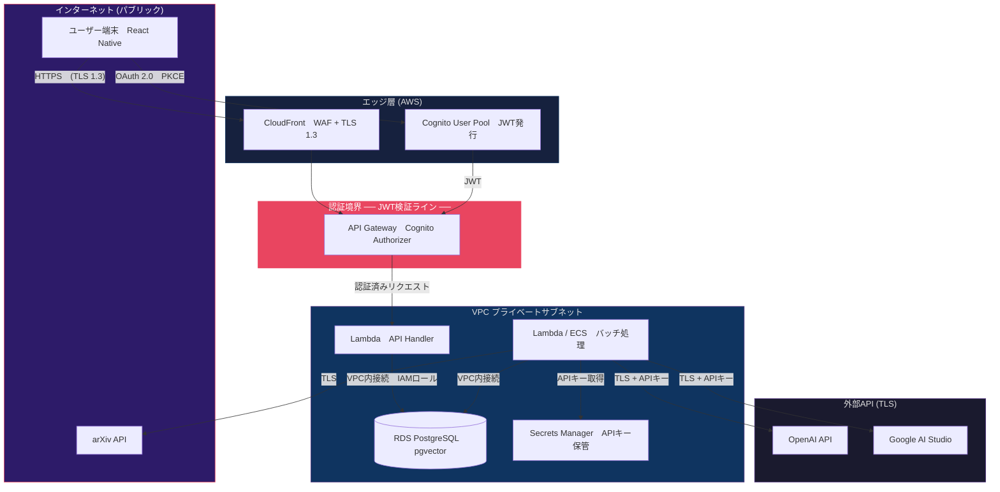

# セキュリティ設計書

## 1. 概要
本システムのセキュリティ境界を定義し、認証・認可・データ保護・秘密情報管理の方針を明文化する。

---

## 2. セキュリティ境界図



---

## 3. 認証・認可

### 3.1 認証フロー（Cognito）

| 項目 | 設定 |
|:---|:---|
| **User Pool** | メール + SNS (Google, Apple) |
| **認証方式** | OAuth 2.0 Authorization Code + PKCE |
| **トークン** | JWT (ID Token + Access Token + Refresh Token) |
| **ID Token 有効期限** | 1時間 |
| **Refresh Token 有効期限** | 30日 |
| **MFA** | オプション（将来対応） |

### 3.2 API認可

```
全APIエンドポイントに Cognito Authorizer を適用

Authorization: Bearer <ID_TOKEN>

├── /api/papers          GET    認証必須
├── /api/papers/:id      GET    認証必須
├── /api/bookmarks       GET    認証必須（自分のもののみ）
├── /api/bookmarks       POST   認証必須
├── /api/bookmarks/:id   DELETE 認証必須（自分のもののみ）
├── /api/settings        GET    認証必須
├── /api/settings        PUT    認証必須
└── /api/health          GET    認証不要（ヘルスチェック）
```

### 3.3 認可ルール

| リソース | ルール |
|:---|:---|
| 論文データ (papers) | 全ユーザーが閲覧可能（認証後） |
| ブックマーク | 自分のブックマークのみ CRUD 可能 |
| ユーザー設定 | 自分の設定のみ R/U 可能 |
| バッチ処理 | ユーザーからのアクセス不可（内部のみ） |

---

## 4. データ保護

### 4.1 通信の暗号化

| 区間 | プロトコル |
|:---|:---|
| ユーザー ↔ CloudFront | TLS 1.3 |
| CloudFront ↔ API Gateway | TLS 1.2+ |
| Lambda ↔ RDS | TLS (rds-ca-rsa2048-g1 証明書) |
| バッチ ↔ 外部API | TLS 1.2+ |

### 4.2 保存データの暗号化

| データ | 暗号化 |
|:---|:---|
| RDS ストレージ | AES-256 (AWS KMS マネージドキー) |
| S3 | SSE-S3 (デフォルト暗号化) |
| Cognito ユーザーデータ | AWS管理の暗号化 |

### 4.3 個人情報の取り扱い

| データ | 分類 | 保護方針 |
|:---|:---|:---|
| メールアドレス | PII | Cognito内に保管。DBにはコピーを持つが暗号化カラムは不要（VPC内のみアクセス可） |
| パスワード | 機密 | Cognito が bcrypt + salt でハッシュ化。アプリ側では一切保持しない |
| 閲覧履歴 | 行動データ | bookmarks テーブルに記録。退会時に CASCADE DELETE |
| 論文データ | 公開情報 | arXiv公開データのため機密性なし |

---

## 5. 秘密情報管理

### 5.1 APIキーの管理

| キー | 保管場所 | 用途 |
|:---|:---|:---|
| OpenAI API Key | AWS Secrets Manager | Embedding生成 (L2) |
| Google AI Studio Key | AWS Secrets Manager | Gemini呼び出し (L3) |
| RDS パスワード | AWS Secrets Manager | DB接続 |

### 5.2 アクセス制御

```
バッチ Lambda の IAM ロール:
├── secretsmanager:GetSecretValue (指定ARNのみ)
├── rds-db:connect (指定DBインスタンスのみ)
├── s3:PutObject (figures/* プレフィックスのみ)
└── logs:PutLogEvents (CloudWatch)

API Lambda の IAM ロール:
├── rds-db:connect (指定DBインスタンスのみ)
├── cognito-idp:GetUser (トークン検証)
└── logs:PutLogEvents (CloudWatch)
```

### 5.3 禁止事項

| ❌ やってはいけないこと | ✅ 正しい方法 |
|:---|:---|
| `.env` にAPIキーをハードコード | Secrets Manager から実行時に取得 |
| GitリポジトリにキーをPush | `.gitignore` + trufflehog でCI検出 |
| Lambda環境変数に平文で設定 | Secrets Manager ARN を参照 |

---

## 6. ネットワーク設計

```
VPC: 10.0.0.0/16
├── Public Subnet (10.0.1.0/24, 10.0.2.0/24)
│   └── NAT Gateway (外部API接続用)
├── Private Subnet (10.0.10.0/24, 10.0.11.0/24)
│   ├── Lambda (API)
│   ├── Lambda / ECS (Batch)
│   └── RDS (Multi-AZ)
└── Security Groups
    ├── sg-lambda: Outbound 443 (HTTPS), Inbound なし
    ├── sg-rds: Inbound 5432 from sg-lambda のみ
    └── sg-batch: Outbound 443 (HTTPS), Inbound なし
```

### セキュリティグループルール

| SG | Inbound | Outbound |
|:---|:---|:---|
| **sg-lambda** | なし | 443 (HTTPS) → 外部, 5432 → sg-rds |
| **sg-rds** | 5432 ← sg-lambda, sg-batch のみ | なし |
| **sg-batch** | なし | 443 (HTTPS) → 外部, 5432 → sg-rds |

---

## 7. 監視 & インシデント対応

| 監視項目 | ツール | アラート条件 |
|:---|:---|:---|
| API エラー率 | CloudWatch | 5xx > 5% / 5分 |
| Lambda 実行時間 | CloudWatch | > 10秒 |
| RDS CPU | CloudWatch | > 80% / 10分 |
| RDS ストレージ | CloudWatch | 残り < 20% |
| 不正ログイン試行 | Cognito Advanced Security | 異常検知時 |
| APIキー漏洩 | trufflehog (CI) | 検出時にビルド失敗 |
