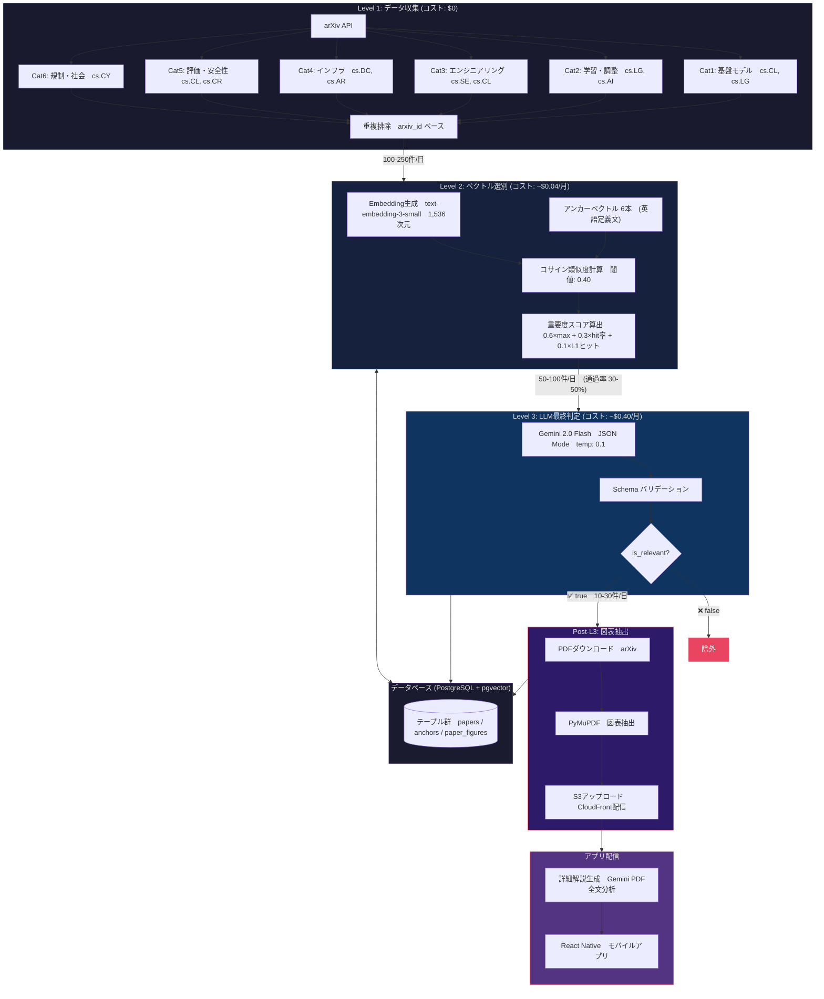
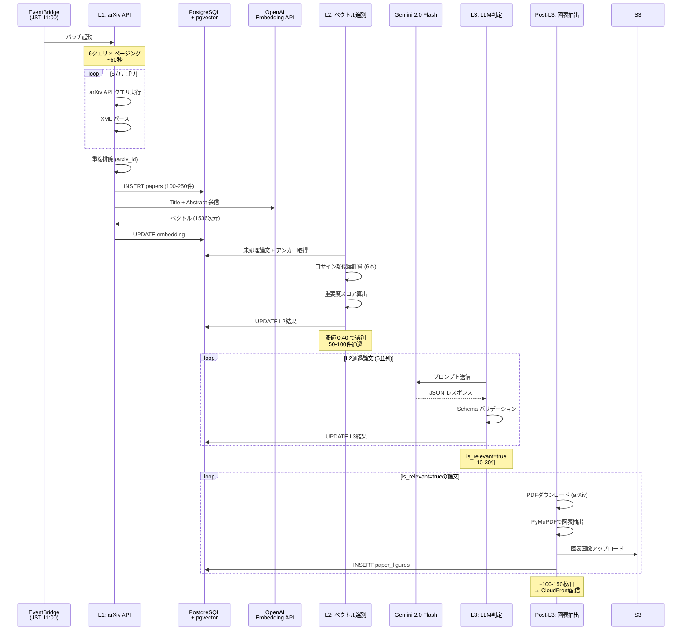
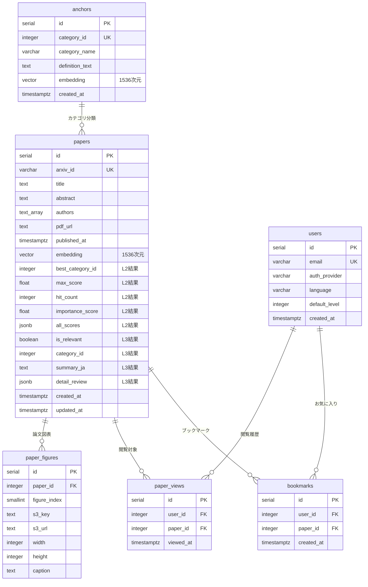
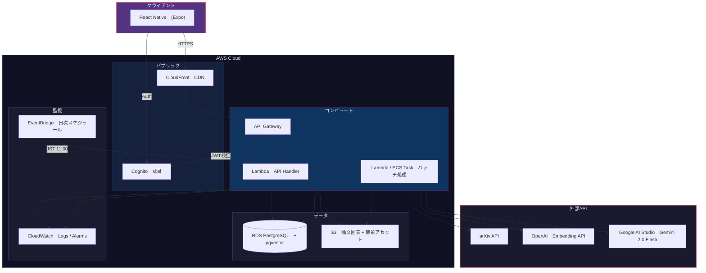
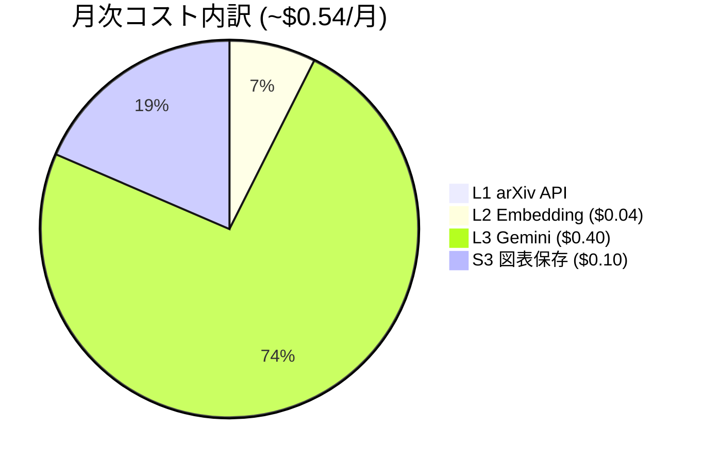

# システム設計図

## 1. 全体パイプライン（3段階フィルタリング）

```mermaid
flowchart TB
    subgraph L1["Level 1: データ収集 (コスト: $0)"]
        direction TB
        arxiv["arXiv API"]
        q1["Cat1: 基盤モデル　cs.CL, cs.LG"]
        q2["Cat2: 学習・調整　cs.LG, cs.AI"]
        q3["Cat3: エンジニアリング　cs.SE, cs.CL"]
        q4["Cat4: インフラ　cs.DC, cs.AR"]
        q5["Cat5: 評価・安全性　cs.CL, cs.CR"]
        q6["Cat6: 規制・社会　cs.CY"]
        dedup["重複排除　arxiv_id ベース"]

        arxiv --> q1 & q2 & q3 & q4 & q5 & q6
        q1 & q2 & q3 & q4 & q5 & q6 --> dedup
    end

    subgraph L2["Level 2: ベクトル選別 (コスト: ~$0.04/月)"]
        direction TB
        embed["Embedding生成　text-embedding-3-small　1,536次元"]
        anchors["アンカーベクトル 6本　(英語定義文)"]
        cosine["コサイン類似度計算　閾値: 0.40"]
        scoring["重要度スコア算出　0.6×max + 0.3×hit率 + 0.1×L1ヒット"]

        embed --> cosine
        anchors --> cosine
        cosine --> scoring
    end

    subgraph L3["Level 3: LLM最終判定 (コスト: ~$0.40/月)"]
        direction TB
        gemini["Gemini 2.0 Flash　JSON Mode　temp: 0.1"]
        validate["Schema バリデーション"]
        judge{is_relevant?}

        gemini --> validate --> judge
    end

    subgraph FigExt["Post-L3: 図表抽出"]
        direction TB
        pdf_dl["PDFダウンロード　arXiv"]
        extract["PyMuPDF　図表抽出"]
        s3up["S3アップロード　CloudFront配信"]

        pdf_dl --> extract --> s3up
    end

    subgraph Storage["データベース (PostgreSQL + pgvector)"]
        direction TB
        papers[("テーブル群　papers / anchors / paper_figures")]
    end

    subgraph App["アプリ配信"]
        direction TB
        detail["詳細解説生成　Gemini PDF全文分析"]
        mobile["React Native　モバイルアプリ"]

        detail --> mobile
    end

    dedup -->|"100-250件/日"| L2
    scoring -->|"50-100件/日　(通過率 30-50%)"| L3
    judge -->|"✅ true　10-30件/日"| FigExt
    judge -->|"❌ false"| reject["除外"]
    s3up --> App

    L2 <--> Storage
    L3 --> Storage
    FigExt --> Storage

    style L1 fill:#1a1a2e,stroke:#16213e,color:#e0e0e0
    style L2 fill:#16213e,stroke:#0f3460,color:#e0e0e0
    style L3 fill:#0f3460,stroke:#533483,color:#e0e0e0
    style FigExt fill:#2d1b69,stroke:#e94560,color:#e0e0e0
    style Storage fill:#1b1b2f,stroke:#533483,color:#e0e0e0
    style App fill:#533483,stroke:#e94560,color:#e0e0e0
    style reject fill:#e94560,stroke:#e94560,color:#ffffff
```

---

## 2. バッチ実行シーケンス

```mermaid
sequenceDiagram
    participant Scheduler as EventBridge<br/>(JST 11:00)
    participant L1 as L1: arXiv API
    participant DB as PostgreSQL<br/>+ pgvector
    participant Embed as OpenAI<br/>Embedding API
    participant L2 as L2: ベクトル選別
    participant LLM as Gemini 2.0 Flash
    participant L3 as L3: LLM判定

    Scheduler->>L1: バッチ起動
    Note over L1: 6クエリ × ページング<br/>~60秒

    loop 6カテゴリ
        L1->>L1: arXiv API クエリ実行
        L1->>L1: XML パース
    end

    L1->>L1: 重複排除 (arxiv_id)
    L1->>DB: INSERT papers (100-250件)

    L1->>Embed: Title + Abstract 送信
    Embed-->>L1: ベクトル (1536次元)
    L1->>DB: UPDATE embedding

    L2->>DB: 未処理論文 + アンカー取得
    L2->>L2: コサイン類似度計算 (6本)
    L2->>L2: 重要度スコア算出
    L2->>DB: UPDATE L2結果

    Note over L2: 閾値 0.40 で選別<br/>50-100件通過

    loop L2通過論文 (5並列)
        L3->>LLM: プロンプト送信
        LLM-->>L3: JSON レスポンス
        L3->>L3: Schema バリデーション
        L3->>DB: UPDATE L3結果
    end

    Note over L3: is_relevant=true<br/>10-30件

    participant FE as Post-L3: 図表抽出
    participant S3 as S3

    loop is_relevant=trueの論文
        FE->>FE: PDFダウンロード (arXiv)
        FE->>FE: PyMuPDFで図表抽出
        FE->>S3: 図表画像アップロード
        FE->>DB: INSERT paper_figures
    end

    Note over FE: ~100-150枚/日<br/>→ CloudFront配信
```

---

## 3. データベース ER図

```mermaid
erDiagram
    papers {
        serial id PK
        varchar arxiv_id UK
        text title
        text abstract
        text_array authors
        text pdf_url
        timestamptz published_at
        vector embedding "1536次元"
        integer best_category_id "L2結果"
        float max_score "L2結果"
        integer hit_count "L2結果"
        float importance_score "L2結果"
        jsonb all_scores "L2結果"
        boolean is_relevant "L3結果"
        integer category_id "L3結果"
        text summary_ja "L3結果"
        jsonb detail_review "L3結果"
        timestamptz created_at
        timestamptz updated_at
    }

    anchors {
        serial id PK
        integer category_id UK
        varchar category_name
        text definition_text
        vector embedding "1536次元"
        timestamptz created_at
    }

    users {
        serial id PK
        varchar email UK
        varchar auth_provider
        varchar language
        integer default_level
        timestamptz created_at
    }

    bookmarks {
        serial id PK
        integer user_id FK
        integer paper_id FK
        timestamptz created_at
    }

    paper_figures {
        serial id PK
        integer paper_id FK
        smallint figure_index
        text s3_key
        text s3_url
        integer width
        integer height
        text caption
    }

    paper_views {
        serial id PK
        integer user_id FK
        integer paper_id FK
        timestamptz viewed_at
    }

    papers ||--o{ bookmarks : "ブックマーク"
    users ||--o{ bookmarks : "お気に入り"
    users ||--o{ paper_views : "閲覧履歴"
    papers ||--o{ paper_views : "閲覧対象"
    papers ||--o{ paper_figures : "論文図表"
    anchors ||--o{ papers : "カテゴリ分類"
```

---

## 4. AWS インフラ構成図

```mermaid
flowchart TB
    subgraph Client["クライアント"]
        mobile["React Native　(Expo)"]
    end

    subgraph AWS["AWS Cloud"]
        subgraph Public["パブリック"]
            cf["CloudFront　CDN"]
            cognito["Cognito　認証"]
        end

        subgraph Compute["コンピュート"]
            apigw["API Gateway"]
            lambda["Lambda　API Handler"]
            batch["Lambda / ECS Task　バッチ処理"]
        end

        subgraph Data["データ"]
            rds[("RDS PostgreSQL　+ pgvector")]
            s3["S3　論文図表 + 静的アセット"]
        end

        subgraph Observe["監視"]
            cw["CloudWatch　Logs / Alarms"]
            eb["EventBridge　日次スケジュール"]
        end
    end

    subgraph External["外部API"]
        arxiv["arXiv API"]
        openai["OpenAI　Embedding API"]
        gemini["Google AI Studio　Gemini 2.0 Flash"]
    end

    mobile -->|HTTPS| cf --> apigw
    mobile -->|Auth| cognito
    apigw -->|JWT検証| cognito
    apigw --> lambda --> rds
    lambda --> s3

    eb -->|"JST 11:00"| batch
    batch --> arxiv
    batch --> openai
    batch --> gemini
    batch --> rds
    batch --> s3

    batch --> cw
    lambda --> cw

    style Client fill:#533483,stroke:#e94560,color:#ffffff
    style AWS fill:#0f1123,stroke:#16213e,color:#e0e0e0
    style External fill:#1a1a2e,stroke:#e94560,color:#e0e0e0
    style Public fill:#16213e,stroke:#0f3460,color:#e0e0e0
    style Compute fill:#0f3460,stroke:#533483,color:#e0e0e0
    style Data fill:#1b1b2f,stroke:#533483,color:#e0e0e0
    style Observe fill:#1b1b2f,stroke:#533483,color:#e0e0e0
```

---

## 5. コストサマリ

```mermaid
pie title 月次コスト内訳 (~$0.54/月)
    "L1 arXiv API" : 0
    "L2 Embedding ($0.04)" : 4
    "L3 Gemini ($0.40)" : 40
    "S3 図表保存 ($0.10)" : 10
```
